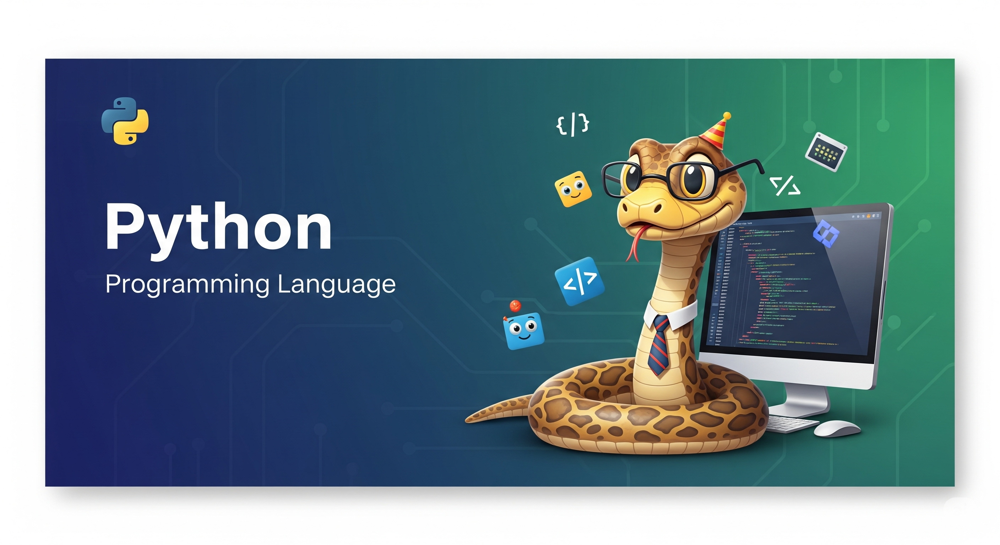

# Python

## Python with Jadi

- [Data Structures](jadi/data-structures.md)
- [Conditions & Loops](jadi/conditions-loops.md)
- [Methods & Functions](jadi/methods-functions.md)
- [OOP](jadi/oop.md)
- [Packages](jadi/packages.md)
- [Error Handling](jadi/error-handling.md)
- [Decorators](jadi/decorators.md)
- [Generators](jadi/generators.md)
- [Python Standard Library](jadi/python-stl.md)
- Python Applications
  - [Web Scraping](jadi/web-scraping.md)
  - [Working with Images](jadi/images.md)
  - [Working with Files](jadi/files.md)
  - [Working with Web Modules](jadi/web-modules.md)
- [Virtual Environment](jadi/venv.md)